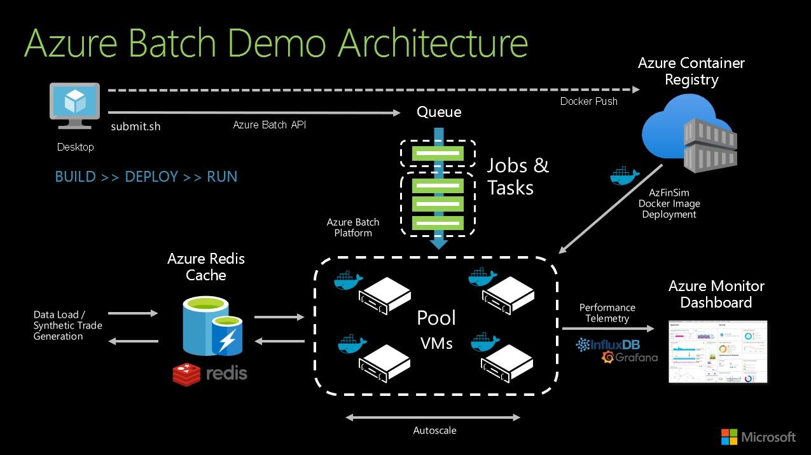

# AzFinSim: Fintech Risk Simulation for the Azure Batch Container Platform

Create 1 million synthetic trades, inject them into a Redis cache and process them with containerized application code on Azure Batch, capturing Telemetry in Application Insights, and output logs in Azure BLOB Storage. 

# Overview
 AzFinSim is a reference implementation for automated (terraform) deployment of containerized Azure Batch applications which scales to 10's of thousands of cores. While the application provided is a synthetic risk simulation designed to demonstrate high throughput in a financial risk/grid scenario, the actual framework is generic enough to be applied to any embarrassingly parallel / high-throughput computing style scenario. If you have a large scale computing challenge to solve, deploying this example is a good place to start, and once running it's easy enough to insert your own code and libraries in place of azfinsim.

 

To see azfinsim in action, watch the <a href="https://youtu.be/r5jxlwJQEPc"> youtube video</a> (slides <a href=img/slides.pdf>here</a>). 

# Quickstart
If you just want to get it going - here's how (ensure you first have the <a href="https://github.com/mkiernan/azfinsim#pre-requisites">pre-requisites</a> in place): 

## Launch 
```
# Clone this github
git clone https://github.com/mkiernan/azfinsim.git; cd azfinsim/bin

# Login into Azure
az login 

# Deploy the infrastructure to Azure using terraform [~15 minutes]
./deploy.sh

# Generate 1,000,000 synthetic trades and inject into the redis cache [~2 minutes]
./generator.sh

# Build the application container and push to the azure container registry [~3 minutes]
./build.sh

# Submit batch jobs to process the trades [30 seconds]
./submit.sh 

# Tear down the infrastructure [~10 minutes]
./destroy.sh 
```

## Observe 

Bring up your Batch Explorer UI and you should see the batch pool has autoscaled up, and the job is running:


By default this will run 3 jobs, each processing the full 1 million trades, so 3 million PUT's & GET's from the cache. The time to run will depend directly on the amount of cores you have in your pool (1600 in the screenshot above, but you can scale MUCH larger than that...). 

## Monitor 

Telemetry is captured with Application Insights, and viewable in the <a href="https://ms.portal.azure.com/#dashboard">Azure Portal Dashboards</a> section.  

 


# Pre-Requisites:  

## Tools
Get <a href="https://azure.github.io/BatchExplorer/">Batch Explorer</a>, and <a href="https://azure.microsoft.com/en-us/features/storage-explorer/">Storage Explorer</a> and login to your Azure account via the UI's. 

For launching the azfinsim commands <a href="https://ubuntu.com/blog/ubuntu-on-wsl-2-is-generally-available">Ubuntu 20.04 on WSL2</a> is highly recommended. You will need to install the following utilities: <a href="/en-us/cli/azure/install-azure-cli" data-linktype="absolute-path">Azure CLI</a>, docker-ce, terraform, redis-tools, jq & git. An <a href="https://github.com/mkiernan/azfinsim/blob/master/bin/prep_ubuntu.sh">ubuntu install script</a> is provided to install these packages for you. 

Another convenient launchpad for azfinsim is <a href=https://shell.azure.com/Azure> Azure Cloud Shell</a>, as it has all of these tools installed already: 

<p><a href="https://shell.azure.com" data-linktype="external"></a></p>

NB: You will not be able to run the container creation step "build.sh" from the cloud shell as it does not have docker daemon support. You'll need to run the container build on another platform where you have docker installed as suggested above. 

## Python Environment
Whichever client you use, you will need to configure the python environment (either in your shell or use virtualenv): 
```
sudo apt-get install -y python3-pip
sudo pip3 install -r src/requirements.txt
```

## CPU Core Quota
Ensure sure you have sufficient <a href="https://docs.microsoft.com/en-us/azure/batch/batch-quota-limit">core quota</a> in the region you want to deploy in. The demo configuration by default uses 200 x D8s_v3 VM's, so 1600 cores. To make this simpler, we are using User Subscription Mode for Azure Batch, which means the VM's will run using the core quotas in your subscription, rather than you needing to request Batch account specific quotas (required in "Batch Service" mode). If in doubt, open a core quota helpdesk ticket via the Azure Portal. 

# Deeper Dive 

This section covers the deployment in a bit more detail with some explanation of what is happening at each step. 

## 1. Deploy & Destroy

To initiate the deployment make sure you are logged in with Azure CLI, and that you are connected to the subscription you want to deploy into. Terraform will utilize your user credential and the current subscription to deploy. 
```
az login
az account list -o table
az account set --subscription <your target subscription GUID>
git clone https://github.com/mkiernan/azfinsim.git
cd bin; ./deploy.sh 
```
The deploy.sh script does the following: 
1) Registers the azfinsim application with AAD and creates a Service Principal and secret for the application to authenticate. 
2) Deploy the infrastructure in the diagram above using Terraform
      1) A VNET & Subnet for our Batch Pool machines 
      2) A Keyvault for storing secrets such as our Redis & Container Registry passwords
      3) An Azure Redis Cache Premium Tier 6GB for storing the trade data
      4) An Azure Container Registry Premium Tier for our Docker Container(s)
      5) An Azure Batch Account in User Subscription Mode with two pools: 
         1) An Autoscaling Batch Pool
         2) A static "Realtime" Pool for low-latency calculations 
      6) A Storage Account for usage with Azure Batch 
3) After successful terraform deployment, the script automatically creates a configuration file config/azfinsim.config - this configuration file is required to for the other utilities (such as job submission) to authenticate and communicate with the components of the environment we have just deployed. 

Note that by default we are using Premium services for components such as Redis & the Container Registry; this is because we need these components to handle the workload (100's or 1000's of simultaneous container pulls and Redis PUT/GETs) as we scale out the Batch compute pool. If you are just testing at a small scale, feel free to edit your terraform code and downgrade these to lower cost components. 

Once deployed, you can look in the <a href=https://portal.azure.com>Azure Portal</a> and search for the newly created resource group which should contain the following resources: 
 

If you want to rename your resource group and the resources within to align to a specific naming scheme, you can edit the file terraform/varables.tf and change the "prefix" variable prior to running the deploy.sh script - the default is "azfinsim" (which is set to "mkazfinsim" in the example above). 

The terraform state for the deployment is recorded in the terraform/terraform.tfstate file. If you need to destroy the infrastructure the recommended way to do so is via a terraform destroy - or use this wrapper script: 
```
cd bin; ./destroy.sh
```
Alternatively, you can destroy the resources manually by deleting the resource group, the service principal and the dashboard via the Azure Portal. Remember also to delete the terraform.tfstate file before redeploying. 

NB: Be careful how you manage both the terraform.tfstate and the azfinsim.config file as they may contain clearcase credentials that will provide access to your resources. 

## 2. Generate the Synthetic Trade Data

For the Batch work we'll pre-fill the cache with trades (simulating an end of trading day data upload). We do this with the generator.sh script, which will SET the trades directly into the Redis Cache.
```
cd bin; ./generator.sh
```
You can configure the generator.sh script to create as many trades as you like, and select the number of threads to speed things up as required. Example output:


Creating 1 million trades will take around 3 minutes depending on your client and latency. The process is multithreaded and requests are generated and pipelined together for upload in batches of 10,000 by default. Once the process is complete, you'll notice the number of keys stored in redis has risen to 1 million (this image form the dashboard we created with terraform): 

 

### Connecting to Azure Redis Cache

There should be no reason to do so, but should you need access to Redis to examine the trades you've uploaded, you can use either of the following tools:

1) redis-cli: https://redis.io/topics/rediscli 
2) redis-insight: https://redislabs.com/redis-enterprise/redis-insight/

To authenticate with either of these tools you'll need the hostname or IP of your redis server (find it by clicking on your Redis Cache in the Azure Portal), and you'll need the password. The password was generated by Terraform and stored in Azure Keyvault. You'll find it here under "secrets" along with the Application Insights Key, the Container Registry password and the Storage Account SAS key: 


Just click on the AzFinSimRedisKey, current version and "Show Secret Value" - this is the password you need to login to Redis. A script is also provided: "get_keys.sh" to make this easier from the command line. 

Since this is a demo environment, the Terraform install has enabled the non-SSL port (redis-tools does not support SSL), so connect to port 6379. Alternatively you can use the "redis_conn.sh" helper script to connect directly without having to lookup the password/hostname/port. 

## 3. Build the Application Container
The next step requires us to assemble the application into a container and push it to our container registry, so that it can subsequently be pulled into our Batch Pool. The application can be anything; in this case the azfinsim application is built in python, and we will package it up into a Docker container. The build.sh script does this according to the src/Dockerfile.azfinsim, creating a runtime environment for the azfinsim.py code which will be our execution engine on the Batch pool: 
```
cd bin; ./build.sh
```
The script may prompt for a root password to execute docker commands. To avoid that, first add your user id to the docker group:
```
sudo usermod -aG docker
# logout/login
id -nG
```
### Optional: Test the Application Container Locally

Once the container is built you can test it locally to ensure it is functioning, using the test_container.sh script provided - the output should look like this: 


The test reads one trade at a time from redis starting at trade number 1000, calculates a price and writes the result back out to redis, logging the times taken for the i/o and the computation. 

Our next step is to run this at scale, and process our entire 1 million trades on our Batch pool. 

## 4. Submit a Batch Job

The default job submission method is: 
```
./submit.sh 
```

This will submit 3 types of jobs to the autoscale pool which are documented in the script: 

```
# DEMO RUN PV Only 1K Trades, 10K Monte Carlos : ~7 seconds/trade
../src/submit.py --job-id "PV_MonteCarlo10K" --pool-id $POOL --start-trade 0 --trade-window $TRADES --tasks $TASKS --threads 100 --cache-type redis --cache-name $AZFINSIM_REDISHOST --cache-port $AZFINSIM_REDISPORT --cache-ssl yes --format eyxml --algorithm pvonly --failure 0.0

# Delta Vega : ~0.5 seconds per trade
../src/submit.py --job-id "DeltaVega" --pool-id $POOL --start-trade 0 --trade-window $TRADES --tasks $TASKS --threads 100 --cache-type redis --cache-name $AZFINSIM_REDISHOST --cache-port $AZFINSIM_REDISPORT --cache-ssl yes --format eyxml --algorithm deltavega --failure 0.0

# SYNTHETIC run - 50 milliseconds per trade
../src/submit.py --job-id "Sythetic50ms" --pool-id $POOL --start-trade 0 --trade-window $TRADES --tasks $TASKS --threads 100 --cache-type redis --cache-name $AZFINSIM_REDISHOST --cache-port $AZFINSIM_REDISPORT --cache-ssl yes --format eyxml --algorithm synthetic --task-duration 50 --mem-usage 16 --failure 0.0
```

Feel free to edit the script and adjust the Pool, the number of trades to process and the number of tasks. Generally it's more efficient to group batches of trades together to send as a single task so that no compute time is wasted polling the batch queue for more work (the Azure Batch built-in scheduler is not designed for low-latency). In the default example, we process 1 million trades with 1000 trades per task. Thus if you have 1000 cores in your batch pool, each core will receive one task and will process 1000 trades each immediately. If you have only 100 cores in your pool, then 100 tasks will process the first 100,000 trades

### Viewing Running Jobs  

If you click on the "Jobs" menu in the Batch Explorer UI, you'll see the three running jobs there: 


Click on one of the jobs and tasks, and you can drill into the logs/outputs in real time as the batch job is running. You'll see similar output as shown in the test_container.sh output above. All of these stats & timers are also being sent to application insights which we'll show below. 


### Viewing Saved Job Outputs 

Once the jobs are finished the autoscale algorithm will reduce the pool size back down to zero. This means that the job outputs will no longer be accessible on the nodes, as the nodes have been deleted. However, the submit.py code we called to run the job contains code to ensure that the job outputs are saved to a Storage BLOB account container. The easiest way to view the outputs is with <a href="https://azure.microsoft.com/en-us/features/storage-explorer/">Azure Storage Explorer</a> under the hierarchy Pool->Job->Task->stdout.txt: 


### Accessing Live nodes

In a dev environment it's normal to access the pool nodes to troubleshoot any issues that may be affecting the application code. Do this by selecting the pool in the Batch Explorer UI, and right-clicking on the node you wish to access:


This will automatically generate login credentials and bring up a terminal to access the pool node. At this point you can see the running job with the "top" command (each python/docker process represents one task)

 

The logs we viewed earlier along with all the relevant batch files, the start task, and every running task are under the /mnt directory: 


## 5. Run a "Real Time" Calculation

This is work in progress... 

## 6. Monitoring & Telemetry 


## Known Issues

* This example is intended to be demo quality, not production quality, and uses public endpoints for simplicity and convenience. A further example will be made available shortly utilizing private endpoints. 
* The terraform deploy fails to ceate the service principal from time to time - this issue appears transient, so just delete the resource group and redeploy. Error: <i>"When using this permission, the backing application of the service principal being created must in the local tenant"</i>

## Roadmap
* Private Link
* Harvest VM Support
* Realtime calculations & Redis Queue 
* Task prorities & dependencies

## Common Errors and how to resolve 

* Job fails with azfinsim.py error "TypeError: a bytes-like object is required, not 'NoneType'" : this simply means that the trade value does not exist in the Redis cache - check you have run the generator.sh to fill the cache, and check your submit.sh is reading the right range of trades. 

* Job fails with container error: "ConainerInvalidImage: One or more container images are invalid" - this just means that the container you are calling does not exist. Check that you have run the build.sh script to create the container and push it to the registry. 

### References 

<a href="https://www.microsoft.com/en-us/research/publication/providing-slos-for-resource-harvesting-vms-in-cloud-platforms/">Harvest Whitepaper</a>
